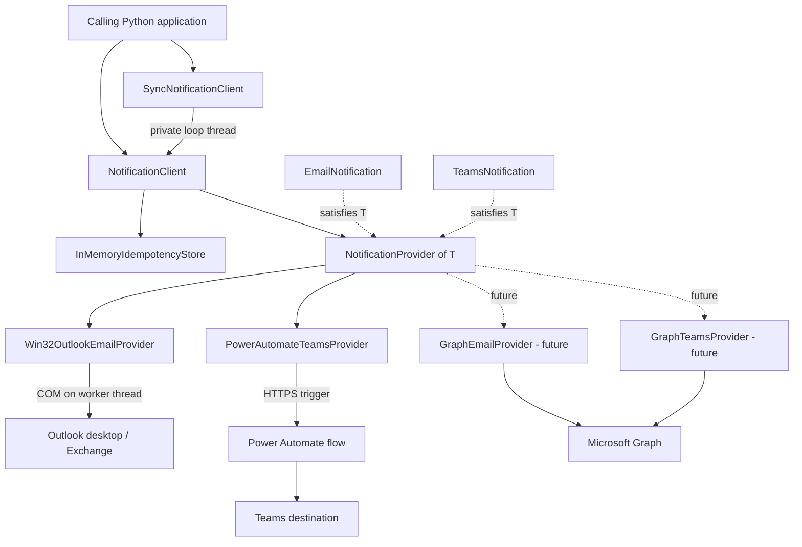
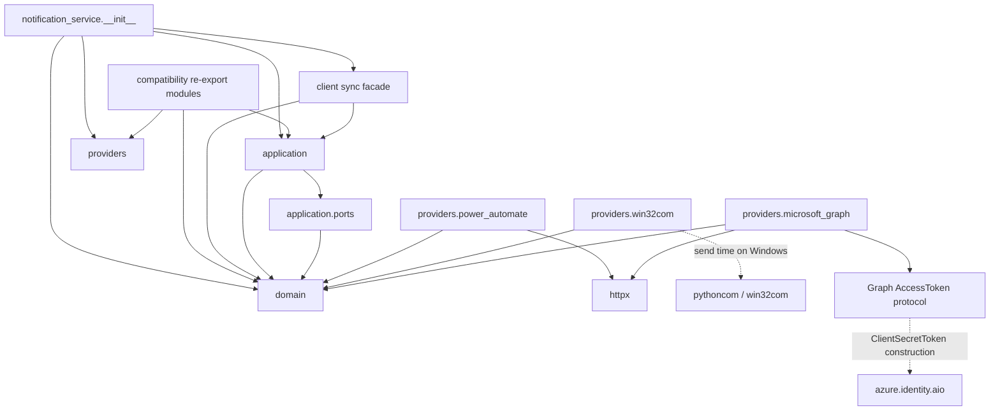
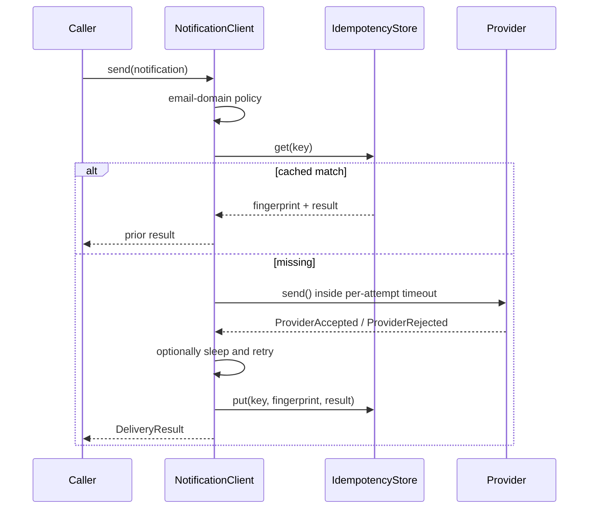
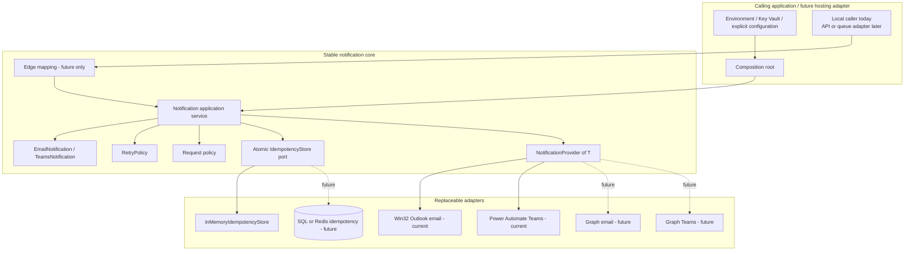
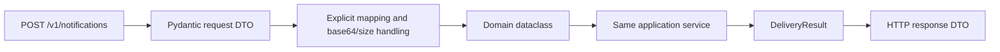

# Notification Service Refactor Assessment

Status: Phase Zero architectural assessment only  
Assessment date: 2026-09-09  
Repository revision: `fe3f6f5` (`main`)  
Production-code changes made during this phase: none

## Executive summary

This repository already has the right architectural center of gravity. The domain models are
provider-neutral, the application service depends on a structural provider port, and Win32 Outlook,
Power Automate, and Microsoft Graph are isolated under provider packages. Importing the public
package performs no network, process, secret-loading, database, or background-thread work. The
current structure should be evolved, not replaced.

The implementation is not production-ready yet. The most important defects are semantic rather
than organizational:

1. The idempotency check is a non-atomic `get` followed by delivery followed by `put`. Concurrent
   calls with the same key both send. Concurrent calls with the same key and different content both
   send and neither reports a conflict.
2. `asyncio.timeout()` can cancel the coroutine awaiting `asyncio.to_thread()` but cannot stop the
   Outlook thread. Cancellation releases the provider's `asyncio.Lock`, so another COM send can run
   concurrently while the first is still executing. This was reproduced locally.
3. Caller cancellation is not converted into or persisted as an ambiguous result. A caller can
   cancel after provider acceptance, retry the same request, and duplicate a notification.
4. Python 3.13 is not the configured or locally verified runtime. Packaging, Ruff, and mypy all
   target Python 3.12 today.
5. Retry and error classifications are conservative in some places but are not consistently tied to
   the operation phase. Graph in particular can classify failures before and after its send boundary
   identically.
6. The Graph adapters have a good isolation boundary but should remain explicitly experimental.
   Their credential ownership, token invalidation, raw authentication failures, orphan-draft
   behavior, and operation-phase classifications need work before production selection.
7. The test suite is a useful start but has only 13 tests. It does not protect architecture
   boundaries, public import behavior, provider contracts, sync lifecycle, concurrent idempotency,
   cancellation, COM lifecycle, or most error classifications.

The smallest coherent target is still an imported async application core with immutable,
channel-specific dataclasses; one generic structural provider protocol specialized by notification
type; an atomic idempotency port; one small deterministic retry policy; a lightweight application
policy hook; hardened adapters; and a synchronous facade around the async core. FastAPI, Pydantic,
SQLAlchemy, Redis, queues, containers, and Azure SDK observability do not belong in this refactor.

## Audit scope and method

The audit read every tracked repository file, including:

- `pyproject.toml`, `README.md`, and `.gitignore`;
- all 24 Python files under `src/notification_service/`;
- all four test modules and every test;
- all architecture, configuration, deployment, provider, testing, and PR-guide documents;
- the two-commit history to identify prior public API shapes and compatibility intent;
- the built wheel contents and package metadata;
- current Microsoft and Python package documentation where behavior is time-sensitive.

Runtime probes were used to characterize imports, quality gates, concurrency, idempotency, COM
timeout behavior, and synchronous-facade construction failure. No live Microsoft account, Outlook
installation, webhook, or Graph tenant was used.

## Baseline verification

The machine used for this audit has Python 3.12.10 and no `python` or Python 3.13 executable. A clean
temporary virtual environment was created with `py -3.12 -m venv`; the project and development extras
were installed through pip. No project dependency was installed with `uv`.

| Check | Observed result |
|---|---|
| `py -3.12 --version` | Python 3.12.10 |
| `py -3.12 -m pip install -e ".[dev]"` in a clean temporary venv | Passed |
| `python -m pytest -q` after editable install | 13 passed |
| `ruff check .` | Passed |
| `ruff format --check .` | Failed: Python blocks in `README.md` and `docs/configuration.md` would be reformatted |
| `mypy src` | Passed in strict mode configured for Python 3.12 |
| `python -m build` | Built sdist and wheel successfully |
| `python -m pip check` | Passed |
| `pytest --cov=notification_service` | Unavailable because `pytest-cov` is not in the development extra |
| Import side-effect probe | No network connection, subprocess, environment mutation, or new thread |

The first direct test run without installation failed collection because a `src/` package is not
importable from the repository root by default. That is expected for a src layout; the documented
quality-gate sequence must make the editable pip install an explicit prerequisite.

### Python 3.13 compatibility assessment

The source uses features available in Python 3.13, including PEP 695 generic syntax introduced in
3.12. No source-level incompatibility with 3.13 was found. The principal dependencies are plausible
on 3.13: pywin32 308 publishes CPython 3.13 Windows wheels, HTTPX is pure Python with a broad Python
requirement, and current Azure Identity supports maintained modern Python versions. Relevant package
records are [pywin32 308](https://pypi.org/project/pywin32/308/),
[HTTPX](https://pypi.org/project/httpx/), and
[Azure Identity](https://pypi.org/project/azure-identity/).

This is not execution proof. The repository currently declares `requires-python = ">=3.12"`, Ruff
targets `py312`, mypy targets 3.12, there is no Python 3.13 CI, and no Python 3.13 interpreter was
available locally. Python 3.13 compatibility therefore remains **unverified** until the complete
gate runs on CPython 3.13, including a Windows job that installs the Outlook extra. The target
metadata should be `>=3.13,<3.14` as requested.

## Current architecture

### Static structure

- `domain/models.py` contains frozen email and Teams models, recipients, in-memory attachment
  content, fingerprinting, and provider outcomes.
- `domain/errors.py` contains stable library errors.
- `application/ports.py` defines one contravariant structural `NotificationProvider` protocol.
- `application/service.py` contains result normalization, email-domain policy, timeout, retry,
  idempotency, and provider shutdown.
- `client.py` contains the synchronous facade, which owns a private event-loop thread.
- `providers/win32com/outlook.py` performs blocking Outlook COM composition and send work via
  `asyncio.to_thread()`.
- `providers/power_automate/teams.py` accepts one complete Teams workflow webhook URL per provider and
  owns or borrows an `httpx.AsyncClient`.
- `providers/microsoft_graph/` contains future email and Teams adapters, a common HTTP base, and an
  access-token protocol.
- Root-level modules such as `models.py`, `service.py`, and `outlook.py` are compatibility re-exports.
- Package `__init__.py` acts as a public convenience surface and imports domain, application, and all
  provider families. It is a composition-facing export module, not domain code.

### Current runtime topology



### Import dependency map

In this diagram `A --> B` means “A imports B.” Optional library imports are lazy where shown.



The important boundary is already correct: domain imports no application or infrastructure module;
application imports no concrete provider, HTTPX, pywin32, Azure Identity, or hosting framework; and
providers depend inward on domain types. Providers do not subclass the protocol, which is normal and
desirable for structural typing.

### Async delivery path



The gap between `get` and `put` is the idempotency race. The timeout covers each provider call only;
it does not cover retry sleep or the complete delivery operation.

### Ownership and lifecycle today

| Resource | Current owner | Current close behavior | Assessment |
|---|---|---|---|
| Provider | `NotificationClient` by convention | `NotificationClient.aclose()` always calls provider `aclose()` | Ownership is implicit; async client has no closed state or context manager |
| Internal PA HTTP client | PA provider | Closed by provider | Correct |
| Injected PA HTTP client | Calling application | Not closed by provider | Correct and tested only indirectly |
| Internal Graph HTTP client | Graph base | Closed by provider | Correct |
| Injected Graph HTTP client | Calling application | Not closed by provider | Correct |
| Graph token/credential | Graph provider, unconditionally | Always closed by provider | Ambiguous and unsafe when injected/shared |
| Outlook COM application/mail item | One `to_thread` call | COM initialized/uninitialized per call | Objects stay inside the call, but executor-thread overlap after cancellation is unsafe |
| Sync event loop/thread | `SyncNotificationClient` | Stopped and joined by `close()` | Normal close is deterministic; construction failure leaks the thread |
| In-memory idempotency data | Store/client instance | Never expires | Process-local only and grows for the instance lifetime |

## What is already good and should be preserved

1. **Real inward dependency direction.** Domain and application code do not import provider or
   hosting concerns.
2. **Channel-specific models.** Email and Teams capabilities are explicit. There is no giant model
   full of unrelated optional fields.
3. **Structural provider port.** A generic `Protocol` is lighter and more substitutable than an ABC.
   Separate runtime base classes are not justified.
4. **Provider-neutral caller requests.** Logical Teams destination names keep webhook URLs and Graph
   channel IDs out of application input.
5. **Explicit configuration.** The host constructs providers and owns environment/Key Vault access.
   Imports do not read secrets.
6. **Optional platform dependencies.** pywin32 is Windows-only and imported only when the adapter is
   used. Azure Identity is imported only when `ClientSecretToken` is constructed.
7. **Conservative three-state result.** `accepted`, `failed`, and `unknown` are the right application
   concepts. Ambiguous failures are generally not retried.
8. **HTTP client injection and ownership flag.** This enables deterministic unit tests and connection
   pooling without forcing the provider to close borrowed clients.
9. **Power Automate security boundary.** Callers choose a validated logical destination; only trusted
   construction maps it to a webhook. The endpoint and token are excluded from configuration repr.
10. **No response-body leakage.** Current provider results use sanitized messages/codes rather than
    returning Graph or Power Automate bodies.
11. **COM isolation.** Raw COM objects do not escape the adapter, and the ordinary production path
    initializes and uninitializes COM in the same worker call.
12. **Explicit attachment bytes.** Providers never read arbitrary caller paths. `from_path()` performs
    explicit caller-side I/O before delivery.
13. **Graph model compatibility.** Both Graph adapters already consume the same email/Teams domain
    types as current providers, preserving the intended migration seam.
14. **Small dependency set.** Hatchling, HTTPX, optional Azure Identity, and optional pywin32 are
    proportionate. No framework, database, queue, or dependency-injection container is present.

## Problems found

Severity reflects production notification risk, not code style.

### Critical

#### C-01 — Idempotency is not atomic and does not prevent concurrent duplicates

- **Location:** `application/service.py:35-54, 87-96, 143-149`
- **Current behavior:** The service calls `get`, sends outside the store lock, then calls `put` with
  `setdefault`. A local probe issued two concurrent same-key calls and observed two provider sends.
  Two different payloads under the same key also both sent and both returned normally.
- **Why problematic:** This violates the feature's primary guarantee precisely under concurrent queue
  delivery. `setdefault` silently preserves only one result while the losing caller returns its own,
  potentially different result. The `get`/`put` port cannot express an atomic claim in SQL or Redis
  without orchestration changes.
- **Recommended change:** Replace `get`/`put` with a small atomic reservation protocol that returns one
  of new, replay, conflict, or in-progress. Complete the reservation with the normalized result. The
  in-memory implementation should coordinate concurrent tasks; a future persistent adapter can use a
  unique key plus transaction/compare-and-set and a lease/recovery policy.
- **Migration risk:** High. Idempotency semantics are externally observable. Preserve existing
  sequential replay and conflict behavior with characterization tests before changing concurrency.
- **Tests required:** Same key/same payload concurrently; same key/different payload concurrently;
  provider failure while holding a reservation; owner cancellation; waiter cancellation; replay of
  accepted/failed/unknown; store exception; retention/lease behavior once decided.

#### C-02 — Outlook timeout/cancellation defeats serialization and permits concurrent COM sends

- **Location:** `providers/win32com/outlook.py:52-56`; `application/service.py:98-106`
- **Current behavior:** The provider holds an `asyncio.Lock` while awaiting `asyncio.to_thread()`.
  `asyncio.timeout()` cancels that await but cannot stop the OS thread. The lock is released while
  `MailItem.Send()` is still running. A second call enters another worker thread. A local probe
  observed two concurrent `Send()` calls despite the lock.
- **Why problematic:** Outlook COM automation is sensitive to apartment/thread behavior. More
  importantly, callers receive `unknown` while an untracked send continues, and later sends can
  overlap it. Shutdown does not wait for these detached operations.
- **Recommended change:** Give the Outlook provider one owned, single-worker executor (or equivalent
  dedicated serial worker) and keep every COM object wholly within one submitted operation. A timed
  out/cancelled operation may continue, but subsequent work must remain queued behind it and
  `aclose()` must account for in-flight work. Do not cache COM objects across calls.
- **Migration risk:** Medium-high. Threading changes require real Windows/Outlook release testing even
  when fake-COM unit tests pass.
- **Tests required:** Timeout while `Send()` blocks; external cancellation; maximum COM concurrency of
  one; queued sends; close with in-flight work; exact CoInitialize/CoUninitialize balance; no COM
  object crossing threads; Windows smoke send.

#### C-03 — Caller cancellation can lose delivery certainty without an idempotency record

- **Location:** `application/service.py:87-133`
- **Current behavior:** `CancelledError` propagates and bypasses `_remember`. The provider request may
  already have been accepted. HTTP cancellation and Outlook thread cancellation cannot prove
  non-acceptance.
- **Why problematic:** Upstream workers commonly cancel tasks during timeout or shutdown and then
  redeliver queue work. The same idempotency key is not useful if the first attempt left no record or
  reservation. Blind redelivery can duplicate email or Teams messages.
- **Recommended change:** Define cancellation semantics explicitly with the atomic reservation. At a
  minimum, cancellation after provider invocation begins must leave an in-progress/unknown record
  until the operation can be reconciled. Decide whether shutdown waits for an in-flight provider,
  returns/records unknown immediately, or uses a bounded drain; do not infer “failed.”
- **Migration risk:** High because cancellation latency and exception propagation affect hosts.
- **Tests required:** Cancellation before provider invocation, during connect, during response wait,
  during retry sleep, during Outlook send, and during idempotency completion; same-key replay after
  each case.

### High

#### H-01 — Python 3.13 is neither configured nor execution-verified

- **Location:** `pyproject.toml:8, 18, 25`; all install/testing documentation; absent CI
- **Current behavior:** Package metadata accepts Python 3.12 and every future version, while Ruff and
  mypy target 3.12. Only Python 3.12.10 was available during this audit.
- **Why problematic:** This directly misses a non-negotiable runtime requirement and could publish an
  artifact to unsupported interpreters.
- **Recommended change:** Set `requires-python = ">=3.13,<3.14"`, Ruff `py313`, mypy 3.13, add accurate
  classifiers, and execute all gates on CPython 3.13. Include a Windows 3.13 job for installation and
  fake-COM tests, plus a controlled Outlook release gate.
- **Migration risk:** Medium. Existing 3.12 consumers will no longer install future releases.
- **Tests required:** Full lint/type/test/build/pip-check on Python 3.13; wheel install/import test;
  Windows `.[outlook-win32]`; optional `.[graph]`; combined extras.

#### H-02 — Public API and backward-compatibility policy are unresolved

- **Location:** `notification_service/__init__.py`; root compatibility modules; git history
- **Current behavior:** Root exports include future Graph adapters as though supported. Compatibility
  modules retain some old paths, but the previous `PowerAutomateEmailProvider` and the
  `EmailNotification.metadata` field disappeared while package version remains 0.1.0. `EmailProvider`
  became an unparameterized alias of the generic protocol.
- **Why problematic:** It is impossible to decide which shims can be removed or which signatures must
  remain without consumer evidence. Experimental code on the root surface looks production-supported.
- **Recommended change:** Inventory actual consumers, declare root imports as the supported API,
  document semantic versioning/deprecation, and mark Graph explicitly experimental without an
  accidental breaking move. Add a public API/import snapshot. Do not preserve unused shims forever.
- **Migration risk:** Potentially critical if 0.1.0 is deployed; low if the repository is pre-release.
- **Tests required:** Every supported import path and constructor; package version consistency;
  deprecation behavior; install-from-wheel consumer smoke test.

#### H-03 — Frozen domain objects are only shallowly immutable

- **Location:** `domain/models.py:43-165`
- **Current behavior:** Type hints say tuples/bytes, but runtime construction accepts mutable lists and
  bytearrays. Frozen dataclasses then retain those mutable references. Mutating recipients,
  attachments, or content changes the fingerprint after construction.
- **Why problematic:** Idempotency identity must be stable. A “frozen” request whose fingerprint can
  change undermines conflict detection, caching, safe retries, and future serialization.
- **Recommended change:** Normalize accepted collections to tuples and bytes in `__post_init__` (or
  reject wrong runtime types consistently). Validate the value objects themselves where practical.
  Keep dataclasses; Pydantic is not needed in the core.
- **Migration risk:** Medium. Normalization is compatible for most callers; strict rejection could
  break callers passing lists.
- **Tests required:** Mutation attempts, list/bytearray input, fingerprint stability, canonical
  ordering policy, attachment hashing, and same-content reconstruction.

#### H-04 — Outlook setup/teardown exceptions can leak raw infrastructure errors

- **Location:** `providers/win32com/outlook.py:68-83, 85-116`
- **Current behavior:** Import failures are normalized and composition/send failures are broadly
  caught, but `CoInitialize`, `Dispatch`, and `CoUninitialize` failures are outside the normalizing
  catch. A custom application factory bypasses COM initialization entirely. Every pre-`Send()`
  exception is marked retryable, including deterministic composition/file failures.
- **Why problematic:** Callers may see pywin32 exceptions, and deterministic bad input can be retried.
  Cleanup exceptions can mask the actual delivery result. The injection seam is safe for tests but
  dangerous if treated as a production COM factory.
- **Recommended change:** Isolate the untyped COM boundary in one function, normalize initialization,
  dispatch, composition, send, and cleanup by phase, and make test injection explicitly internal or
  documented as non-COM. Separate known-not-accepted from transient/retryable.
- **Migration risk:** Medium because existing error codes and retry counts may change.
- **Tests required:** Failure at COM init, Dispatch, CreateItem, each property assignment, attachment
  write/Add, `Send`, and uninitialization; error sanitization; temp cleanup; no pywin32 on non-Windows.

#### H-05 — Graph credential ownership and authentication failure behavior are unsafe

- **Location:** `providers/microsoft_graph/auth.py`; `_base.py:13-55`; both Graph `send` methods
- **Current behavior:** A provider always closes its token even when injected, unlike borrowed HTTP
  clients. Sharing a token across providers lets one provider close the other's credential.
  `ClientSecretToken.invalidate()` closes the credential rather than invalidating a cached token.
  The method is otherwise unused. Token acquisition exceptions occur outside or escape the HTTP
  normalization path. If HTTP client close raises, token close may be skipped.
- **Why problematic:** Lifecycle is surprising, authentication errors can leak Azure SDK details, and
  a future 401-refresh path cannot use the stated invalidation contract safely.
- **Recommended change:** Make token ownership explicit, simplify or correct the token protocol, map
  authentication failures to sanitized stable codes, and close independent resources with guaranteed
  cleanup. Do not assume one token works for both Graph channels.
- **Migration risk:** Medium; experimental code should be changed before it gains consumers.
- **Tests required:** Borrowed/owned token and HTTP-client matrices; shared token; token-get failure;
  401 invalidation/retry policy; close failure; idempotent close; no secret in repr/error.

#### H-06 — Provider failure classifications are not consistently operation-aware

- **Location:** Graph adapters, PA adapter, Outlook adapter, and `ProviderRejected` positional fields
- **Current behavior:** Graph Email catches network errors around draft creation, attachments, and
  send with one broad handler. A non-202 Graph send response is always ambiguous, even a definitive
  4xx. Graph Teams treats all HTTP responses as known non-acceptance, including 5xx. Outlook treats
  all pre-send exceptions as transient. PA's 429 assumption is not backed by a checked-in flow
  contract. Boolean positional fields make mistakes hard to spot.
- **Why problematic:** Retry safety depends on whether the acceptance boundary was crossed, not only
  exception/status type. Incorrect certainty either duplicates messages or suppresses safe recovery.
- **Recommended change:** Document an acceptance boundary per adapter and classify each operation
  phase. Prefer named arguments and, subject to compatibility, an explicit acceptance-certainty enum
  over two adjacent booleans. Keep the application states accepted/failed/unknown.
- **Migration risk:** High because returned state and retry behavior are API semantics.
- **Tests required:** The complete matrix in “Required failure semantics” below for every provider.

#### H-07 — Tests do not yet protect the architectural contract

- **Location:** `tests/`; `pyproject.toml`
- **Current behavior:** Thirteen tests cover basic success, one retry, timeout, sequential idempotency,
  one domain policy, selected PA behavior, basic fake Outlook composition, and three Graph cases.
  There are no architecture guards or shared channel-provider contracts.
- **Why problematic:** The highest-risk behavior is untested. A later Graph swap cannot be certified
  against the same channel contract, and inward dependencies can regress silently.
- **Recommended change:** Add characterization tests first, a small AST-based dependency guard, public
  import/no-I/O tests, and channel-specific provider contract suites. Reorganize only enough to make
  unit/contract/platform boundaries clear.
- **Migration risk:** Low; some characterization tests will intentionally expose current defects and
  should be marked/structured so main remains green until the corresponding fix PR.
- **Tests required:** All categories listed in the requested Definition of Done, with priority on the
  critical findings before structural changes.

### Medium

#### M-01 — Retry timing is hard-coded, nondeterministic, and not a total budget

- **Location:** `application/service.py:98-125`; PA and Graph Retry-After parsing
- **Current behavior:** At most two attempts use uncontrolled `random.uniform(0.5, 1.5)`. There is no
  exponential schedule, injected sleeper/random source, maximum Retry-After, or total deadline.
  `retry_after_seconds or jitter` ignores a valid zero. PA accepts infinite floating-point values;
  Graph only accepts digit strings; HTTP-date calculation is tied to wall-clock time.
- **Why problematic:** Tests sleep in real time, latency is unpredictable, and a malicious or broken
  Retry-After can hold a caller indefinitely outside the provider timeout.
- **Recommended change:** Add one focused immutable `RetryPolicy` with maximum attempts, exponential
  base/cap, injectable jitter and sleeper, total budget, and bounded Retry-After precedence. This is
  not a general resilience framework.
- **Migration risk:** Medium because call latency changes.
- **Tests required:** Deterministic attempt schedule; zero/negative/NaN/infinite/HTTP-date Retry-After;
  cap and total budget; cancellation during sleep; no retry for unknown.

#### M-02 — Domain and configuration validation have security and correctness gaps

- **Location:** `domain/models.py`; `PowerAutomateWebhook`; `TeamsChannel`
- **Current behavior:** Correlation IDs are unbounded/unvalidated and later become HTTP headers.
  `source_application` accepts whitespace. Email validation permits malformed DNS forms and does not
  define normalization. Attachment filenames allow Windows-reserved names and characters such as
  colon/NUL until filesystem use. `Attachment.from_path()` reads an unbounded file before aggregate
  limits run. Configuration destination names are not validated against the domain pattern.
- **Why problematic:** Bad values fail late in adapters, can become raw protocol/filesystem errors,
  and complicate future API validation. This is not a call for full RFC email parsing.
- **Recommended change:** Define modest canonical constraints for correlation/source, recipients,
  attachment names/types/sizes, and configured destination keys. Add a bounded path loader or clearly
  document that `from_path` is trusted caller I/O. Keep HTML unsanitized for email by design and state
  that the caller owns content trust.
- **Migration risk:** Medium because stricter validation rejects previously accepted inputs.
- **Tests required:** Boundary lengths, whitespace/control characters, domain labels, case policy,
  Windows filename hazards, oversized path input, and header injection attempts.

#### M-03 — Operational observability is effectively absent

- **Location:** Entire package
- **Current behavior:** No logging, duration, attempt event, provider name, or lifecycle event is
  emitted. `DeliveryResult` contains only state, message ID, attempts, and error code.
- **Why problematic:** Production operators cannot correlate an upstream job to an adapter attempt or
  distinguish failure classes without adding wrappers around internals.
- **Recommended change:** Emit standard-library logging events with structured `extra` fields for
  correlation ID, source application, channel, logical destination, provider, attempt, duration,
  state, and sanitized code. Do not add OpenTelemetry now. Never log content, attachments, tokens,
  webhook URLs/query strings, or recipient addresses by default.
- **Migration risk:** Low-medium; logging volume and privacy policy require agreement.
- **Tests required:** Captured structured fields, level policy, timing injection, and explicit secret,
  body, attachment, and recipient non-disclosure assertions.

#### M-04 — Sync-facade construction failure leaks its event-loop thread

- **Location:** `client.py:20-55`
- **Current behavior:** The thread starts before the async factory is awaited. If the factory raises,
  `__init__` exits without stopping or closing the loop. A local probe observed the daemon thread
  remain alive. Concurrent `send`/`close`, close failures, and factory cancellation are undefined.
- **Why problematic:** Repeated construction failures leak threads in long-running hosts. A daemon
  thread hides the issue at process exit rather than resolving it.
- **Recommended change:** Use exception-safe staged construction and cleanup, add explicit state and
  bounded close behavior, and document thread/event-loop ownership. Keep the private-loop-thread
  approach; do not call `asyncio.run()` per send.
- **Migration risk:** Low-medium.
- **Tests required:** Factory success/failure, provider close failure, idempotent close, send after
  close, active-loop rejection, multiple caller threads, close racing with send, context manager.

#### M-05 — Power Automate's wire contract and network policy are underspecified

- **Location:** `providers/power_automate/teams.py`; `docs/providers.md`
- **Current behavior:** Payload `schema_version: 1` is useful but no checked-in contract defines
  required response/status semantics. Any HTTPS endpoint in trusted configuration is accepted;
  environment proxies are enabled. Headers are held through a potentially mutable mapping. A 2xx
  with malformed JSON is accepted with no message ID, which may be correct but is undocumented.
- **Why problematic:** Safe retry classification depends on what the trigger means by 2xx, 429, and
  5xx and whether the flow deduplicates. Proxy behavior can expose secret-bearing URLs to an approved
  corporate proxy, which must be an explicit deployment choice. Trusted configuration prevents
  caller SSRF but still deserves host policy.
- **Recommended change:** Check in a versioned JSON contract/example and status semantics; copy/freeze
  headers; validate destination keys; decide allowed host/private endpoint and `trust_env` policy;
  keep redirects disabled. Treat response-body ID as optional if the flow contract confirms it.
- **Migration risk:** Medium; flow changes require coordinated deployment.
- **Tests required:** Exact payload version, custom header precedence, no redirects, proxy setting,
  malformed optional response, 408/429/all 5xx, HTTP-date Retry-After, secret redaction, URL variants.

#### M-06 — Graph adapters are useful migration prototypes, not drop-in production providers yet

- **Location:** `providers/microsoft_graph/`; public exports and provider docs
- **Current behavior:** Graph Email creates a draft, attaches files, then sends. Failures can leave
  orphan drafts. The shared base removes some duplication but not phase-aware network handling.
  Graph Teams requires a host-supplied delegated token even though `ClientSecretToken` is the only
  included implementation. Both adapters are exported from the root package.
- **Why problematic:** The code shape proves the provider boundary, but current auth and lifecycle
  constraints can mislead users into selecting it. Large attachment sessions in shared/delegated
  mailboxes have a documented Graph caveat.
- **Recommended change:** Keep the code isolated and explicitly experimental. Harden it against the
  channel contract, decide orphan-draft cleanup/reconciliation, and revalidate permissions and API
  limitations at migration time. Do not use migration-only Teams application permissions for normal
  notifications.
- **Migration risk:** Low now, high if prematurely selected.
- **Tests required:** Full email/Teams contracts; every draft/attachment/send phase; upload ranges and
  safe opaque URL; orphan cleanup; auth ownership; national-cloud/base-URL requirements if relevant.

As of this assessment, Microsoft's v1.0 channel-send documentation lists delegated
`ChannelMessage.Send` for ordinary work/school channel sends and lists `Teamwork.Migrate.All` as an
application permission supported only for migration. See
[Send chatMessage in a channel](https://learn.microsoft.com/en-us/graph/api/channel-post-messages?view=graph-rest-1.0).
This must be revalidated when migration begins. Microsoft's large-attachment documentation also
requires `Mail.ReadWrite`, uses a pre-authenticated `outlook.office.com` upload URL, and notes a known
shared/delegated-mailbox issue; see
[Attach large files to Outlook messages](https://learn.microsoft.com/en-us/graph/outlook-large-attachments).

#### M-07 — Async client lifecycle is implicit

- **Location:** `application/service.py:60-85, 152-153`
- **Current behavior:** Public mutable attributes expose provider/store/policy values. The client has
  no async context manager or closed state and can be sent through after `aclose()`. Close ownership
  of an injected provider is by convention only.
- **Why problematic:** Hosted adapters and long-running callers need deterministic startup/shutdown,
  and accidental post-close sends can surface raw HTTP errors.
- **Recommended change:** Define that the client owns the provider passed to it, make state private,
  add `async with` support and idempotent close, and reject send-after-close predictably. If borrowed
  providers are a real requirement, make that explicit rather than implicit.
- **Migration risk:** Low-medium depending on callers reading public attributes.
- **Tests required:** Async context manager, repeated close, send after close, provider close error,
  close with in-flight calls, and shared-provider policy if supported.

#### M-08 — Quality configuration is incomplete for the requested gate

- **Location:** `pyproject.toml`; absent CI configuration
- **Current behavior:** Ruff lint and strict mypy pass under 3.12, but Ruff format check fails on docs,
  `pytest-cov` is absent, tests are not type-checked, and no CI executes the documented gate. Version
  ranges are reproducible enough for a library but not deterministic for CI over time.
- **Why problematic:** A green local subset can differ from the requested Azure DevOps gate, and no
  coverage signal exists.
- **Recommended change:** Add pytest-cov, define coverage scope/threshold based on meaningful branches,
  format checked files, and add a pip-based Python 3.13 pipeline. Keep dependency ranges in
  `pyproject.toml`; optionally use a CI constraints file generated/reviewed through normal pip
  workflows if deterministic rebuilds are required.
- **Migration risk:** Low.
- **Tests required:** Clean-environment pipeline using the exact published commands and install tests
  for base/all relevant extras.

### Low

#### L-01 — Documentation describes intent better than verified reality

- **Location:** `docs/architecture.md`, `docs/providers.md`, `docs/pr-guides/`
- **Current behavior:** Architecture docs claim Outlook sends serialize, which is false after timeout
  cancellation. PR guides describe already-completed creation steps and omit current risks. There is
  no migration roadmap, development guide, compatibility policy, or ADR set.
- **Why problematic:** Operators and reviewers can make unsafe assumptions from concise but incomplete
  statements.
- **Recommended change:** Update docs after behavior changes, replace stale PR guides with the approved
  refactor plan/history as appropriate, add a migration roadmap and a small number of material ADRs.
- **Migration risk:** Low.
- **Tests required:** Documentation examples compiled/formatted; links checked if CI cost is acceptable.

#### L-02 — Package metadata is too sparse for controlled distribution

- **Location:** `pyproject.toml`
- **Current behavior:** The build works, but metadata lacks readme, license, authors/maintainers,
  classifiers, project URLs, and typing marker policy. `__version__` is duplicated manually.
- **Why problematic:** Internal artifact consumers have limited provenance and compatibility metadata.
- **Recommended change:** Add accurate metadata and one version source. Add `py.typed` only if the
  public typing contract is intentionally supported and tested.
- **Migration risk:** Low.
- **Tests required:** Inspect wheel metadata and contents; install/import built wheel.

#### L-03 — Flat tests are beginning to obscure test intent

- **Location:** `tests/`
- **Current behavior:** Unit, contract, architecture, and future live integration concerns have no
  explicit boundaries.
- **Why problematic:** The suite will become difficult to select for Linux CI versus Windows/live
  release gates.
- **Recommended change:** Introduce `unit/`, `contract/`, and lightweight `architecture/` categories.
  Add `integration/` only for tests that actually cross a process/network/platform boundary. Do not
  create empty taxonomy directories.
- **Migration risk:** Low.
- **Tests required:** Test discovery and marker-selection checks.

### Optional improvements explicitly deferred

- Do not add Pydantic to the domain. Future API Pydantic v2 request/response DTOs should map to the
  dataclasses at the hosting edge.
- Do not add `LocalNotificationClient`/`RemoteNotificationClient` today. Introduce a caller-facing
  protocol only when at least one consumer must switch topology.
- Do not add FastAPI, Docker, SQLAlchemy, Alembic, Redis, Celery, Service Bus, OpenTelemetry, or Azure
  hosting code in the current refactor.
- Do not add a provider plugin/factory framework. Explicit host construction is clearer.
- Do not split each model or exception into its own module.
- Do not replace the provider `Protocol` with ABCs. Structural typing fits injected fakes and future
  adapters.

## Required failure semantics

The exact provider contracts must be confirmed, but this is the safe target matrix. “Retry” always
means bounded retry with the same idempotency key and only when acceptance is known not to have
occurred.

| Failure point | Delivery certainty | Automatic retry | Rationale |
|---|---|---|---|
| Domain/policy validation | Failed / not attempted | No | Deterministic caller error |
| Unknown logical Teams destination | Failed / not attempted | No | No external I/O occurred |
| HTTP pool timeout | Failed / not attempted | Yes if policy permits | Request was not assigned a connection |
| DNS/connect/TLS establishment failure | Failed / not accepted | Yes if classification proves no request bytes were sent | Acceptance boundary not reached |
| HTTP write timeout or protocol failure after write begins | Unknown | No | Server may have received the request |
| HTTP read timeout/lost response | Unknown | No | Provider may have accepted the request |
| Application outer timeout | Unknown | No | Cancellation does not prove provider cancellation |
| HTTP 400/401/403/404/413 | Failed / rejected | No, except one explicit auth-refresh path before acceptance | Provider returned a definitive rejection |
| HTTP 408 | Unknown unless provider contract proves rejection | No by default | Server-side timing may follow receipt |
| HTTP 429 | Failed and retryable only if provider contract guarantees no acceptance | Respect bounded Retry-After | Must be verified per provider/flow |
| HTTP 5xx | Unknown by default | No | Processing may have happened before response failure |
| Outlook failure before `Send()` invocation | Failed / not accepted | Only if specifically transient | Safe from duplicates but not necessarily useful to retry |
| Outlook exception during/after `Send()` | Unknown | No | Outlook may have queued/sent the message |
| Graph email draft/attachment failure before send | Email not sent; draft state may be unknown | Potentially yes, with orphan-draft policy | Delivery is safe to retry but side effects need cleanup |
| Graph email `/send` lost response | Unknown | No | Draft may have been sent |
| Graph Teams POST lost response | Unknown | No | Message may have been created |
| Caller cancellation after provider invocation | Unknown/in progress | No immediate redelivery | Must reserve the idempotency key and reconcile/drain |

`ProviderAccepted` means provider acceptance only. It does not guarantee final Exchange delivery,
Power Automate flow completion, Teams connector completion, or human receipt.

## Target architecture

### Proposed structure

```text
src/notification_service/
├── domain/
│   ├── models.py             # immutable channel-specific requests and stable fingerprints
│   └── errors.py             # stable caller-visible exceptions
├── application/
│   ├── ports.py              # provider and atomic idempotency protocols
│   ├── retry.py              # one deterministic, bounded retry policy
│   ├── policies.py           # small host-configured request policy callables if approved
│   └── service.py            # delivery orchestration and normalized result
├── providers/
│   ├── win32com/outlook.py   # current email adapter; owned serial COM executor
│   ├── power_automate/teams.py # current Teams adapter; versioned flow contract
│   └── microsoft_graph/      # explicitly experimental migration adapters
├── client.py                 # exception-safe synchronous facade
└── __init__.py               # deliberately supported public imports
```

The exact file split is intentionally small. `policies.py` should exist only if the agreed email
policy cannot remain clear as an injected callable near the service. A separate generic resilience
package is not proposed.



### Why the port remains generic

Email and Teams capabilities belong in their separate notification types. Both adapter families need
the same two lifecycle operations: `send(T) -> ProviderOutcome` and `aclose()`. The current generic
protocol expresses that without a false common notification payload. For type clarity, public
`EmailProvider` and `TeamsProvider` aliases can specialize the generic protocol; separate ABCs add no
runtime value. Contract tests should be channel-specific because capability behavior differs.

### Domain and serialization boundary

Keep frozen dataclasses after making them deeply stable. They are lightweight, standard-library-only,
and easy to construct from imported callers. A future hosted adapter should use Pydantic v2 DTOs at
the edge:



This prevents FastAPI validation, HTTP status codes, base64 attachment encoding, and API versioning
from entering the domain. A future queue adapter performs the same mapping.

## Current-to-target mapping

| Current component | Decision | Target change |
|---|---|---|
| Frozen `Recipient`, `Attachment`, email/Teams models | Refactor and keep | Normalize deep immutability; tighten bounded validation; preserve channel separation |
| Fingerprint algorithm | Refactor cautiously | Version/document canonical fields and prove stability before any change |
| `ProviderAccepted` / `ProviderRejected` | Refactor cautiously | Make acceptance certainty explicit and arguments hard to misuse; preserve three application states |
| Generic `NotificationProvider` protocol | Keep | Add channel-specialized typing aliases and contract tests, not ABCs |
| `NotificationClient` | Refactor | Keep as orchestration center; extract only retry timing, atomic idempotency, and configurable request policy |
| Email-domain policy inside generic client | Move/refactor | Inject a small application policy so generic orchestration does not branch on email type |
| `InMemoryIdempotencyStore` | Replace implementation and port contract | Atomic claim/complete, concurrency, explicit retention/in-progress semantics; remain process-local |
| Hard-coded random retry | Replace | Focused deterministic bounded `RetryPolicy` |
| `SyncNotificationClient` | Refactor and keep | Exception-safe construction/close and documented private loop ownership |
| `Win32OutlookEmailProvider` | Refactor and keep active | Dedicated serialized executor, full error translation, deterministic close, phase tests |
| `PowerAutomateTeamsProvider` | Refactor and keep active | Versioned flow contract, hardened validation/network policy, full status tests |
| Graph HTTP base | Refactor | Retain truly shared HTTP/auth behavior but make failure handling phase-aware |
| Graph Email/Teams adapters | Keep as experimental | Harden against the same channel contracts; do not activate now |
| `ClientSecretToken` / `AccessToken` | Refactor | Explicit ownership, correct invalidation, sanitized auth failures |
| Root public exports | Refactor after consumer inventory | Deliberate stable API; experimental Graph status; compatibility/deprecation policy |
| Compatibility modules | Keep temporarily or deprecate | Decision requires actual consumer import inventory |
| Flat tests | Move incrementally | Unit, contract, architecture; integration only where real boundaries exist |
| Existing architecture/config/provider docs | Update | Align with verified behavior and approved decisions |
| Existing PR guides | Replace/archive after approval | They describe prior work rather than the upcoming refactor |
| Hatchling/src layout/pip workflow | Keep | Target Python 3.13; complete metadata/gates; no `uv` requirement |

## Future migration analysis

### Win32 Outlook to Graph Email

The domain request and provider call already align. After target hardening, only composition,
Graph-specific configuration/authentication, and deployment dependencies should change. No domain or
application orchestration file should change. Today this is not yet a safe production swap because
the Graph adapter lacks a settled credential lifecycle and complete phase-aware failure tests.

### Power Automate to Graph Teams

Logical destinations and `TeamsNotification` already align. After target hardening, the swap should
change only composition and the trusted mapping from logical name to `TeamsChannel`, plus auth. The
blocking issue is operational: current Microsoft Graph ordinary channel posting requires delegated
user context; migration-only application permission is not a valid unattended notification design.
Revalidate official permissions and alternatives when Stage B begins.

### Imported library to hosted API

No business behavior should move. Add a hosting adapter, transport DTOs, DTO/domain mappers,
authentication/authorization, and composition around the existing service. The hosting adapter owns
HTTP status mapping and request limits. The application service remains callable directly for tests,
workers, and local composition.

### In-memory to shared idempotency

With the current `get`/`put` port, orchestration must be rewritten to gain distributed atomicity. That
is why the atomic reservation port should be fixed now. Once fixed, a future SQL/Redis adapter can
replace the in-memory implementation at composition. Persistent history/audit is a separate future
port and should not be conflated with idempotency today.

### Local logging to distributed observability

Standard logging with stable contextual fields lets a future host bridge records/spans to
OpenTelemetry, Azure Monitor, or Application Insights. Core code should not depend on those SDKs.
Metrics and traces can later wrap the same application/provider boundaries.

### Imported worker to Azure-hosted container

The core should not change among Container Apps, App Service, or AKS. A future Linux container must
select Graph (or another Linux-capable adapter), not win32com. Azure DevOps installs Python 3.13 with
pip, runs gates, builds the hosting artifact/container, and deploys infrastructure outside the core.

## Five architecture tests

1. **Win32 to Graph Email:** Target answer: only provider construction/configuration, optional
   dependency selection, and deployment credentials. No domain/application change.
2. **Power Automate to Graph Teams:** Target answer: only provider construction/configuration,
   destination mapping, and supported authentication. No notification construction or orchestration
   change.
3. **Add FastAPI:** Target answer: add DTOs, mapping, auth, HTTP error mapping, and composition around
   the application layer. No notification business logic moves into FastAPI.
4. **In-memory to distributed idempotency:** Current answer: orchestration would need to change because
   the port is non-atomic. Target answer after this refactor: only store construction/adapter changes,
   subject to configured retention/lease policy.
5. **Move among Azure hosting runtimes:** Target answer: no core package change; hosting/infrastructure
   configuration only.

## Overengineering check

Every proposed abstraction and its justification is listed here.

| Proposed abstraction | Why it is justified now | Why it stays small |
|---|---|---|
| Atomic `IdempotencyStore` reservation contract | Fixes a reproduced current race and creates the real future persistence seam | One protocol and one in-memory implementation; no database |
| `RetryPolicy` value object | Removes uncontrolled time/randomness, bounds Retry-After, and centralizes safety rules used by all providers | No generic middleware, decorators, breaker, or strategy hierarchy |
| Request-policy callable/protocol | Removes concrete `EmailNotification` branching from generic orchestration and supports host-owned domain restrictions | Callable(s), not a policy framework or DI container |
| Channel-specialized provider type aliases/contracts | Makes email/Teams substitutability testable without forcing shared capabilities | Reuses the existing generic protocol; no ABC hierarchy |
| Internal serial COM executor/runner | Fixes demonstrated concurrent COM execution and gives Outlook lifecycle ownership | Adapter-internal implementation, not a public infrastructure framework |
| Explicit Graph token ownership | Fixes current shared-resource closure and auth error leakage | Refines the existing protocol/configuration; no auth framework |

Not proposed: repositories for every type, factories, service locators, CQRS, event sourcing,
framework DI, generic plugin discovery, a database, queue, API framework, container abstraction, or
cloud SDK in the core.

## Provisional incremental PR sequence

This is sequencing guidance, not the final `REFACTOR_PLAN.md`. The detailed per-PR files, compatibility
impact, commits, rollback, and acceptance criteria must be finalized after the questions below are
answered.

1. **Characterize public behavior and establish Python 3.13 gates.** Add import/no-I/O and architecture
   guards, current behavior characterization, dev coverage support, Python 3.13 metadata/tooling, and
   clean pip-based commands. No runtime behavior change.
2. **Stabilize domain and public contracts.** Resolve consumer compatibility, deep immutability,
   bounded validation, fingerprint version/policy, public exports, and deprecation rules.
3. **Make idempotency atomic and cancellation-aware.** Introduce claim/complete semantics, repair
   same-key concurrency/conflicts, and define replay/retention/in-progress outcomes.
4. **Make retry and failure policy deterministic.** Introduce the focused retry policy, explicit
   acceptance certainty, bounded Retry-After, total timing semantics, and the common failure matrix.
5. **Harden Win32 Outlook lifecycle.** Add the serial executor, full COM phase translation, attachment
   cleanup tests, cancellation/shutdown safety, and Windows release instructions.
6. **Harden Power Automate Teams.** Freeze configuration, validate network/destination policy, codify
   schema v1/status semantics, prove secret redaction, and add complete HTTP tests.
7. **Harden async/sync lifecycle and observability.** Add deterministic context management, repair
   sync construction cleanup, establish structured standard logging, and test closure races.
8. **Normalize experimental Graph adapters against provider contracts.** Fix token ownership/auth
   handling, phase-aware email/Teams classifications, orphan-draft policy, upload behavior, and
   experimental API status. Revalidate Microsoft permissions at implementation time.
9. **Complete channel provider contract suites and test organization.** Run the same email contract
   against Win32/Graph and Teams contract against PA/Graph; separate unit/contract/architecture and
   document live gates.
10. **Publish architecture decisions and migration roadmap.** Align README/docs, add only material
    ADRs, document Azure DevOps gate shape, compatibility, current operations, and Stages A-D.

Each PR should leave lint, format, strict mypy, tests, build, and pip check green. Risky behavior work
must begin with characterization tests in the same or immediately preceding PR.

## Material questions requiring owner answers

Implementation should not start until these are answered. Questions that can be resolved from code
have intentionally been omitted.

### Current consumers and backward compatibility

1. Is version 0.1.0 already installed in any production or staging application, or is this repository
   still pre-release?
2. Which import paths and constructor signatures do consumers use? In particular, do any still use
   the original `PowerAutomateEmailProvider`, `EmailNotification.metadata`, root compatibility
   modules, positional model arguments, or public client attributes?
3. May this refactor make breaking API changes under a new pre-1.0 minor version, or must we provide a
   deprecation window? What is the required window?
4. Are provider outcome classes and provider-specific `error_code` strings consumed directly, or is
   `DeliveryResult` the only supported result contract?

### Outlook requirements

5. Is the supported desktop client specifically **classic Outlook for Windows**? The new Outlook app
   does not provide the same COM automation surface.
6. Under what Windows identity/session does the worker run: interactive user, scheduled task,
   Windows service, or another model? Is Outlook already initialized for that identity?
7. What are the required sender semantics: default profile account, send-on-behalf-of, send-as, or
   selecting a specific Outlook account? Must Sent Items land in a particular mailbox?
8. What peak and sustained email throughput is expected, and may multiple application processes use
   the same Outlook profile concurrently?
9. On shutdown or timeout, how long may the host wait for an in-flight Outlook `Send()` before it must
   terminate? Is a bounded drain acceptable?

### Teams and Power Automate contract

10. Please provide or confirm the exact deployed Flow trigger request schema and its response/status
    contract. Does a 2xx mean trigger enqueue only, full flow completion, or successful Teams post?
11. Can the Flow guarantee that 429 means it did not accept/start a run? Can any 5xx occur after the
    run has started?
12. Does the Flow currently deduplicate `idempotency_key` atomically, and if so for how long and at
    what scope? Are Power Automate/connector retries enabled after trigger acceptance?
13. What authentication is used now: signed query URL, bearer token, Entra-protected trigger, APIM, or
    another mechanism? Must custom headers remain public configuration?
14. Should webhook hosts be allowlisted, and must `trust_env=True` support corporate proxies? Are
    private endpoints or nonstandard Power Automate/Logic Apps domains expected?
15. May schema v1 be tightened in place, or must any payload change introduce schema v2 and coordinated
    dual-version deployment?

### Attachments and email content

16. Are the current limits (10 files, 10 MiB each, 20 MiB total) business requirements or provisional
    safeguards? Which file types/names must be supported, including Unicode names?
17. Is temporary plaintext attachment material permitted on the worker disk, and are there endpoint
    security/retention requirements beyond automatic temporary-directory cleanup?
18. Must HTML email accept trusted raw HTML, or is caller-side sanitization/content templating part of
    this package's responsibility?

### Idempotency and retry semantics

19. What is the intended idempotency scope and retention: one client instance, one process, one source
    application, or organization-wide; and for how long?
20. After a known `FAILED` result, should the same key always replay that failure, or may a caller retry
    later with the same key? Should `UNKNOWN` ever be manually resolved/released?
21. Should `source_application` and channel be part of the key namespace/fingerprint, or must callers
    guarantee globally unique keys across applications and channels?
22. If a same-key request is already in progress, should a concurrent caller wait for its result,
    receive an explicit in-progress result/error, or time out? What maximum wait is acceptable?
23. Is `max_attempts=2` the desired production default? Should `timeout_seconds` be a total delivery
    budget or a per-provider-attempt budget, and what maximum Retry-After may be honored?

### Concurrency and lifecycle

24. Will a `NotificationClient`/provider be shared by many tasks on one event loop, across threads, or
    across multiple event loops? The target can support the required model, but it should not promise
    unsupported sharing accidentally.
25. How is the synchronous facade used today, and can its async factory signature change if a simpler
    but deterministic construction API is available?
26. Does the caller require graceful draining of all in-flight sends on `aclose()`, or is recording
    unknown and returning within a fixed deadline preferred?

### Security and observability

27. Should the email-domain policy allow exact domains only or subdomains too? Are external recipients
    ever allowed through an explicit exception mechanism?
28. May recipient addresses appear in logs, should they be hashed/redacted, or must they never be
    logged? What retention/classification applies to correlation IDs and source application names?
29. Which logging fields and levels are operationally required, and does the host already install a
    JSON formatter or logging adapter the library should interoperate with?
30. Are callers trusted application code only, or should the current library defend against
    semi-trusted values before the hosted API exists?

### Graph migration

31. Should Graph adapters remain importable from the root package during the experimental period, or
    may they move behind an explicitly experimental namespace with compatibility re-exports?
32. For future Teams delivery, is delegated user authentication operationally acceptable? If not,
    should Graph Teams remain a research adapter while Power Automate (or a separately approved bot)
    remains the likely unattended path?
33. For Graph Email, is `Mail.ReadWrite` acceptable for draft/attachment handling, or should the future
    design prefer least-privilege `sendMail` where attachment requirements permit? Are shared-mailbox
    large attachments required?
34. Are sovereign/national Graph clouds in scope, or can the Graph and upload host configuration
    remain fixed to the global cloud?

### Future hosting and operations

35. When a hosted API arrives, should a request wait for provider acceptance and return the current
    three-state result, or is queue-first `202 Accepted` the expected contract? This does not change
    today's core, but it affects which result concepts become long-term public contracts.
36. Is delivery history/audit retention a regulatory requirement, and if so what fields and duration
    are required? It should remain separate from idempotency storage.
37. Is Azure DevOps the only required CI system, and may the first implementation add a validation-only
    pipeline now, without deployment/container stages?

## Recommended decision before implementation

Approve the existing ports-and-adapters direction and the proposed small target, then answer the
questions above. After those answers, create `docs/REFACTOR_PLAN.md` with independent PR specifications,
exact compatibility decisions, acceptance criteria, rollback notes, and commit sequences. Production
code should remain unchanged until that plan is reviewed.
