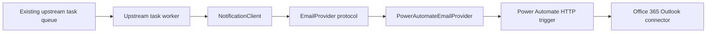

# Import-only architecture

The package is a library, not a service. An existing task queue invokes it directly in the worker that already owns scheduling and retries.

The package has no FastAPI, queue, polling loop, database, or background thread. It owns validation, a provider-independent request model, conservative provider retry classification, and optional process-local idempotency. Shared idempotency belongs in the calling application if it must survive restarts.

Power Automate is the initial transport. The flow receives the request, uses the
Office 365 Outlook connector to send from the configured shared mailbox, and
returns a small response containing an optional flow/run/message reference. The
temporary connection may be the developer's user account. Replace that
connection with an Entra service identity later without changing the package
contract.

Teams is intentionally narrower: a named destination maps to one preconfigured
Power Automate webhook for one channel. The caller supplies the destination
name, never a webhook URL. Destination registration and ownership remain
deployment configuration.

The async API is primary because the webhook/provider call is network I/O. `SyncNotificationClient` provides a single private loop thread for scripts that cannot use `asyncio`; it is not used from notebooks or other active event loops.
