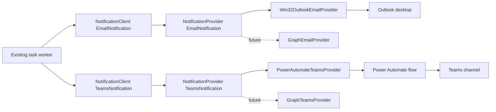

# Architecture

The package follows a small ports-and-adapters layout. Domain and application code contain no
Power Automate, COM, Outlook, or Graph types.



`NotificationClient` owns validation policy, timeouts, conservative retries, normalized delivery
states, and optional idempotency. Providers only translate a domain notification into one external
transport.

The primary API is asynchronous. Power Automate and Graph are network I/O; Outlook COM is moved to
a worker thread and serialized because the Outlook object model is synchronous. The optional
`SyncNotificationClient` owns a private event-loop thread for strictly synchronous callers.

Provider construction is the migration boundary:

```python
# Initial
email_client = NotificationClient(Win32OutlookEmailProvider())
teams_client = NotificationClient(PowerAutomateTeamsProvider(webhooks))

# Later; notification construction and send calls are unchanged
email_client = NotificationClient(GraphEmailProvider(mailbox, token))
teams_client = NotificationClient(GraphTeamsProvider(channels, token))
```

The included idempotency store is process-local. The calling application should implement the
`IdempotencyStore` protocol with shared storage when duplicate protection must survive restarts.
