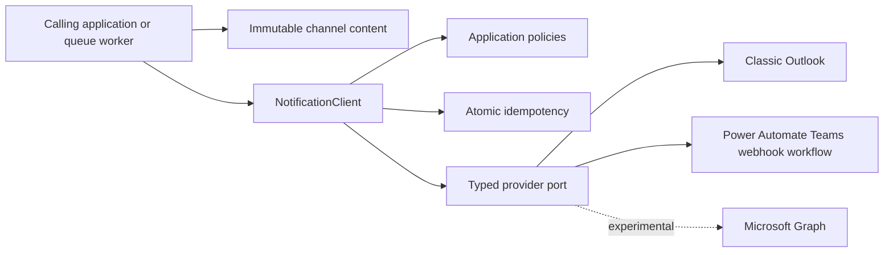

# Architecture

The package uses provider-neutral content, application orchestration, and replaceable
infrastructure adapters.

The caller owns business selection, labels, ordering, and display-ready values. The
library owns validation, escaping, channel limits, table presentation, delivery
certainty, retry, idempotency, lifecycle, and sanitized operational events. It has
no database, template engine, hosted API, queue, scheduler, or fan-out coordinator.

Content models contain no correlation ID, source application, or idempotency key.
Those values describe a delivery and are supplied to `NotificationClient.send()`.
The client passes immutable delivery metadata to the provider.

One typed client owns one provider and one event loop. Many tasks may use it on that
loop, but it must not cross loops or threads. The sync facade owns a dedicated loop
thread. Both facades own provider shutdown.

## Delivery certainty

`ACCEPTED` means the transport accepted the operation. `FAILED` means the package
can prove it was not accepted. `UNKNOWN` means acceptance may have occurred. Only a
proven transient non-acceptance can retry. The default is two attempts within one
120-second budget.

Idempotency scopes a caller key by source application and channel. An atomic claim
ensures concurrent identical calls produce one provider invocation. Conflicting
content fails immediately. Accepted and known-failed values expire after 24 hours;
unknown values require explicit operator resolution.

See [REFACTOR_PLAN.md](REFACTOR_PLAN.md) for the complete decisions and
[adrs](adrs/README.md) for concise decision records.
